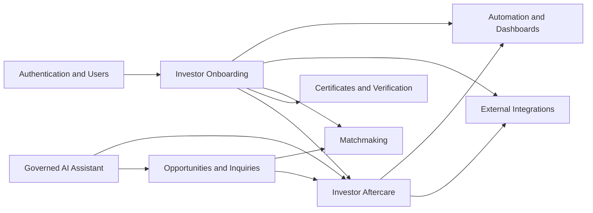
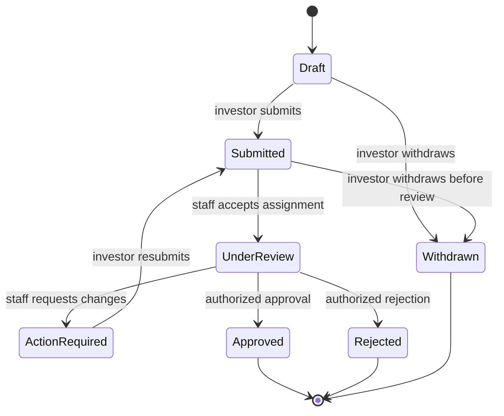

# Investor Onboarding and Aftercare Architecture

Status: Approved prototype direction; onboarding/KYC vertical slice implemented  
Scope: Component 1 foundation with boundaries reserved for Components 2-6  
Last reviewed: 2026-09-01

## Implementation Status

Implemented in the prototype:

- One-to-one investor profiles created atomically during registration, plus an idempotent `chunkById` backfill command.
- UUID-routed onboarding cases with transactional submission/review/decision transitions, row locking, version increments, immutable events, activity audit, SLA dates, and queued notifications.
- Configurable KYC document types and private MediaLibrary storage with file validation, random stored filenames, SHA-256 checksums, quarantine state, policy-authorized downloads, and staff acceptance/rejection.
- Submission requires every applicable required document; approval additionally requires clean-scan and KYC acceptance states.
- Investor portal and staff review queue/detail interfaces with ownership and permission-negative tests.

Prototype boundary: the staff action records a clean malware-scan outcome for demonstration. It does not claim an automated scanning engine. Organization, address, compliance-provider, and aftercare tables remain the next Component 1 increments. JWT/OpenAPI remain Step 5 release work.

## 1. Source Review and Requirement Boundary

This design was prepared after reviewing all files in `pro-docs/`, including extracting the requirement text from:

- `IOMP_SYSTEM _POC.docx`
- `IOMP_Technical_Prototype_Document.docx`
- `districts-list.txt`
- `region-capital-district.json`
- `region-lists.txt`
- `list_of_districts_of_ghanaj.xls`

The client documents explicitly require:

- Investor inquiry submission, tracking, staff response, and notifications.
- RBAC, district-level restrictions where applicable, and audited material actions.
- Versioned REST APIs under `/api/v1/`, JWT authentication, OpenAPI 3.x documentation, and a compatibility policy.
- OWASP-aware controls, secure headers/CSP, HTTPS, environment-managed secrets, validation, security review, and penetration testing.
- At least 95% of API requests within two seconds under agreed load.
- Modular, scalable, horizontally deployable architecture using pagination and indexed queries.
- Admin onboarding tours, preferences, and controlled administrative messaging.

The supplied TOR does not define investor KYC fields, investor onboarding workflow states, Act 1173 renewal rules, certificate rules, payment flows, or retention periods. Those are treated below as client-directed extensions and must be confirmed before production rules are encoded.

## 2. Architecture Decisions

1. Keep `users` as the authentication identity only. Do not add regulatory, organization, KYC, or aftercare columns to it.
2. Introduce an `investor_profiles` aggregate with exactly one profile per investor user.
3. Model organizations independently. A profile may represent an individual and may belong to one or more organizations through explicit memberships.
4. Model onboarding as a case, not as status columns on the profile. This preserves submission history and supports resubmission.
5. Store document metadata in first-class records and file content in a private MediaLibrary collection. Never expose storage paths.
6. Keep workflow history append-only and retain Spatie activity logs for cross-cutting request audit.
7. Keep aftercare cases separate from public inquiries. An inquiry may lead to an aftercare case, but neither owns the other.
8. Reserve certificate, matchmaking, integration, AI, and automation tables for their own bounded contexts. Component 1 exposes stable events and service interfaces to them.
9. Do not create a cached portfolio table initially. Use bounded aggregate queries and add a projection only after profiling proves it is necessary.
10. Use a maintained, security-reviewed JWT implementation if JWT remains contractual. Do not implement token signing or refresh logic manually.

## 3. Bounded Contexts and Dependencies



Component order:

1. Investor onboarding and aftercare foundation.
2. Certificates and anti-forgery verification.
3. Investor-to-business matchmaking.
4. External ORC, GIS, and payment adapters.
5. Governed AI assistant.
6. Internal automation and dashboards.

Certificates depend on approved onboarding outcomes. Matchmaking depends on investor preferences but must not read restricted KYC documents. Integrations communicate through adapters and idempotent jobs. AI receives only explicitly approved, redacted context. Dashboards consume events/read models instead of issuing unbounded transactional joins.

## 4. Component 1 Domain Model

### 4.1 Core tables

#### `investor_profiles`

One-to-one with an investor `user`.

- `id`, `uuid`
- `user_id` unique FK
- `profile_type`: `individual`, `organization_representative`
- `display_name`
- `country_code` ISO 3166-1 alpha-2
- `nationality_country_code` nullable
- `preferred_language`
- `preferred_contact_channel`
- `onboarding_state`: derived convenience state only (`not_started`, `in_progress`, `submitted`, `verified`, `action_required`)
- `status`: `active`, `suspended`, `archived`
- `last_engaged_at`, `onboarded_at`
- `created_by`, `updated_by`, `version`
- timestamps and selective soft deletion

Indexes: unique `user_id`; `(status, last_engaged_at)`; `(onboarding_state, updated_at)`.

Sensitive personal identifiers do not belong in this table.

#### `investor_organizations`

Legal/business entity independent of login accounts.

- `id`, `uuid`
- `legal_name`, `trading_name`
- `registration_country_code`
- `registration_number_encrypted`
- `registration_number_hash` for exact duplicate lookup
- `tax_identifier_encrypted` nullable
- `tax_identifier_hash` nullable
- `organization_type`
- `website`, `phone`, `email`
- `status`: `draft`, `active`, `inactive`
- `created_by`, `updated_by`, `version`
- timestamps and selective soft deletion

Unique constraints should use normalized keyed hashes, not encrypted ciphertext. Raw identifiers must never be logged.

#### `investor_organization_memberships`

Many-to-many membership between profiles and organizations.

- `investor_profile_id`, `investor_organization_id`
- `role`: `owner`, `director`, `authorized_representative`, `advisor`
- `is_primary`
- `started_at`, `ended_at`
- timestamps

Unique active membership: profile + organization + role, enforced according to database capability.

#### `investor_addresses`

Reusable structured address records owned by a profile or organization through explicit nullable FKs with a database check that exactly one owner is present.

- `type`: `residential`, `registered`, `operating`, `postal`
- address lines, city, state/region, postal code, country code
- `is_primary`, `verified_at`

Do not use an unconstrained polymorphic owner for regulated records.

### 4.2 Onboarding case tables

#### `investor_onboarding_cases`

A profile may have multiple cases over time, with at most one open case.

- `id`, `uuid`, `reference` unique
- `investor_profile_id`
- `investor_organization_id` nullable
- `case_type`: initially `initial_onboarding`; future values require migrations/contract review
- `status`: `draft`, `submitted`, `under_review`, `action_required`, `approved`, `rejected`, `withdrawn`
- `assigned_to` nullable staff FK
- `submitted_at`, `review_started_at`, `decided_at`
- `sla_due_at`, `decision_reason`
- `created_by`, `updated_by`, `version`
- timestamps

Indexes: `(status, sla_due_at)`, `(assigned_to, status, updated_at)`, `(investor_profile_id, created_at)`.

State machine:



Every transition uses a transaction and row lock, checks the expected version/state, and writes an event plus audit entry.

#### `investor_onboarding_events`

Append-only transition history.

- `id`, `uuid`
- `investor_onboarding_case_id`
- `action`, `from_status`, `to_status`
- `actor_id` nullable only for system actions
- `reason` nullable
- `metadata` JSON containing non-sensitive, schema-versioned context
- `occurred_at`

Indexes: `(investor_onboarding_case_id, occurred_at)` and `(action, occurred_at)`.

The model must reject update and delete operations, matching existing workflow-event behavior.

#### `investor_documents`

Metadata for private uploads. Attach binary files through Spatie MediaLibrary on a private disk.

- `id`, `uuid`
- `investor_profile_id`
- `investor_onboarding_case_id` nullable
- `document_type_id`
- `status`: `uploaded`, `quarantined`, `accepted`, `rejected`, `expired`
- `issued_at`, `expires_at`
- `verified_at`, `verified_by`, `rejection_reason`
- `checksum_sha256`, `malware_scan_status`, `malware_scanned_at`
- timestamps

Never persist a public URL. Download through policy-authorized controllers using short-lived signed storage URLs or streamed responses. Validate file signatures/MIME, size, extension, image dimensions where applicable, and scan before reviewer access.

#### `investor_document_types`

Client-configured reference data rather than a database enum.

- `code`, `name`, `description`
- `applies_to_profile_type`
- `is_required`, `requires_expiry`, `is_active`, `sort_order`
- timestamps

Document requirements must be confirmed by GIPA before seeding production defaults.

#### `investor_compliance_checks`

Normalized result summary for manual or external checks.

- `id`, `uuid`
- `investor_onboarding_case_id`
- `check_type_id`
- `provider` nullable
- `status`: `pending`, `in_progress`, `clear`, `flagged`, `failed`, `waived`
- `provider_reference` nullable
- `requested_at`, `completed_at`
- `reviewed_by`, `review_note`
- `result_summary` JSON containing approved, non-secret fields only
- timestamps

Unique idempotency boundary: case + check type + request version.

#### `investor_compliance_check_types`

Configurable check definitions such as identity, organization registration, or sanctions review. No check is mandatory until approved by the client and legal/security review.

### 4.3 Aftercare tables

#### `investor_aftercare_cases`

Tracks a support or facilitation journey after onboarding.

- `id`, `uuid`, `reference` unique
- `investor_profile_id`
- `investor_organization_id` nullable
- `opportunity_id` nullable
- `source_inquiry_id` nullable unique
- `category_id`
- `priority`: `low`, `normal`, `high`, `urgent`
- `status`: `open`, `in_progress`, `waiting_on_investor`, `waiting_on_third_party`, `resolved`, `closed`, `cancelled`
- `subject`, `summary`
- `assigned_to`, `district_id` nullable
- `next_action_at`, `sla_due_at`, `resolved_at`, `closed_at`
- `created_by`, `updated_by`, `version`
- timestamps and selective soft deletion

Indexes: `(assigned_to, status, next_action_at)`, `(district_id, status)`, `(investor_profile_id, updated_at)`, `(status, sla_due_at)`.

#### `investor_aftercare_categories`

Client-managed categories with default priority, SLA hours, and active state.

#### `investor_aftercare_interactions`

Append-oriented communication timeline.

- `investor_aftercare_case_id`
- `channel`: `portal`, `email`, `phone`, `meeting`, `system`
- `direction`: `inbound`, `outbound`, `internal`
- `visibility`: `investor_visible`, `staff_only`
- `subject`, `body`
- `actor_id`, `occurred_at`
- timestamps

Edits should be prohibited after a short correction window or represented as superseding records. Restricted staff notes must never appear in investor resources.

#### `investor_aftercare_tasks`

Operational actions separate from communication.

- `investor_aftercare_case_id`
- `title`, `description`
- `status`: `open`, `in_progress`, `completed`, `cancelled`
- `assigned_to`, `due_at`, `completed_at`
- `created_by`, timestamps

Index `(assigned_to, status, due_at)` supports staff queues and reminder jobs.

#### `investor_aftercare_events`

Append-only status/assignment/SLA events using the same transition pattern as onboarding events.

### 4.4 Existing model relationships

- `User hasOne InvestorProfile`
- `InvestorProfile belongsTo User`
- `InvestorProfile belongsToMany InvestorOrganization through InvestorOrganizationMembership`
- `InvestorProfile hasMany InvestorOnboardingCase`
- `InvestorProfile hasMany InvestorDocument`
- `InvestorProfile hasMany InvestorAftercareCase`
- `InvestorInquiry belongsTo User` remains unchanged for compatibility
- `InvestorInquiry hasOne InvestorAftercareCase` through `source_inquiry_id`
- `Opportunity hasMany InvestorAftercareCase`
- `District hasMany InvestorAftercareCase`

An authenticated investor may claim/link an earlier inquiry only after verified control of the inquiry email and an audited linking operation.

## 5. Authorization Model

Use policies for object ownership and permissions for staff capabilities.

Investor rules:

- Investors may view/update only their own profile and organization memberships they are authorized to represent.
- Investors may edit only draft/action-required onboarding cases.
- Investors cannot approve checks, change workflow status directly, assign staff, or read staff-only notes.
- Suspended users cannot mutate onboarding or aftercare records.

Proposed staff permissions:

- `investors.view`
- `investors.review`
- `investors.reassign`
- `investors.compliance.manage`
- `investors.aftercare.view`
- `investors.aftercare.manage`
- `investors.reference-data.manage`
- `investors.export`

District-level restrictions apply to aftercare cases assigned to a district. Super Administrator bypass remains centralized through the existing `Gate::before`. Policies must test both permission and district scope.

## 6. Security and Privacy Baseline

- Classify fields as public, internal, confidential, or restricted before migrations are finalized.
- Encrypt sensitive identifiers at the application layer; use keyed hashes for exact-match lookup and duplicate detection.
- Exclude identifiers, document metadata, tokens, and external payloads from logs and exception context.
- Store documents on a private disk with quarantine and malware scanning states.
- Require re-authentication and MFA for privileged approval/export actions when MFA is implemented.
- Apply CSRF to web actions, strict request validation, output escaping, rate limits, secure session cookies, CSP, HSTS, and other production security headers.
- Use optimistic version checks plus database row locks for transitions.
- Audit actor, action, subject, request correlation ID, route, IP where justified, user agent where justified, before/after safe fields, and timestamp.
- Never permit ordinary UI/API deletion of workflow events, compliance outcomes, issued certificates, or material audit entries.
- Define retention, legal hold, subject-access, correction, and deletion procedures with GIPA/legal counsel. Do not assume a seven-year period without approval.
- Conduct threat modeling, dependency/SAST/DAST checks, file-upload testing, authorization testing, and independent penetration testing before go-live.

## 7. API and Compatibility Design

### 7.1 Version boundary

Keep all endpoints under `/api/v1`. Additive response fields are allowed within v1; removing/renaming fields, changing types/semantics, or tightening accepted values requires a new major API version or documented deprecation window.

Proposed Component 1 endpoints:

```text
POST   /api/v1/auth/login
POST   /api/v1/auth/refresh
POST   /api/v1/auth/logout
GET    /api/v1/investor/profile
PATCH  /api/v1/investor/profile
GET    /api/v1/investor/onboarding-cases
POST   /api/v1/investor/onboarding-cases
GET    /api/v1/investor/onboarding-cases/{case}
PATCH  /api/v1/investor/onboarding-cases/{case}
POST   /api/v1/investor/onboarding-cases/{case}/documents
POST   /api/v1/investor/onboarding-cases/{case}/submit
GET    /api/v1/investor/aftercare-cases
POST   /api/v1/investor/aftercare-cases
GET    /api/v1/investor/aftercare-cases/{case}
POST   /api/v1/investor/aftercare-cases/{case}/interactions
```

Staff endpoints use `/api/v1/staff/investors/...` and the same policy/service layer as web controllers.

### 7.2 Contract rules

- Use JSON:API-like consistency without claiming compliance unless fully implemented.
- Return stable UUIDs externally; never expose internal numeric IDs.
- Use cursor pagination for growing event, interaction, case, and staff queue collections.
- Cap page size and sparse-field/include options.
- Use dedicated API Resources with explicit fields. Never serialize Eloquent models directly.
- Support `Idempotency-Key` for case submission, uploads finalized after scanning, and external/payment commands.
- Include a request correlation ID in responses and audit records.
- Use `ETag` or an explicit `version` for conflict detection on mutable drafts.
- Standardize validation errors and machine-readable error codes.
- Rate-limit authentication, uploads, submissions, exports, and search independently.

JWT selection is a release decision. Evaluate maintained packages for Laravel 12 support, key rotation, refresh-token revocation, asymmetric algorithms, security maintenance, and testability. Keep session authentication for Blade. Do not substitute Sanctum personal access tokens if the contractual requirement remains JWT without written approval.

Publish `openapi/v1.yaml` as the source of truth and expose Swagger UI or ReDoc. CI must lint the specification and run contract tests. New APIs are not complete until documented.

## 8. Query and Memory Design

- Select required columns and eager-load only bounded relationships.
- Never include all documents, events, interactions, and tasks in one profile response.
- Use `withCount`, `withExists`, aggregate subqueries, and one-purpose projections instead of loading collections to count them.
- Use cursor pagination ordered by indexed `(created_at, id)` or `(updated_at, id)` pairs for large queues.
- Use `chunkById` or `lazyById` for reminders, exports, and migrations; dispatch one bounded job per record/batch.
- Do not pass Eloquent collections or binary data into queued jobs. Pass UUID/ID and re-query required columns.
- Stream exports and document downloads.
- Cache stable reference data by versioned keys. Do not cache authorization decisions or mutable KYC outcomes broadly.
- Prevent N+1 regressions with query-count tests for profile, queue, and detail endpoints.
- Add indexes only for measured access paths and verify with production-engine `EXPLAIN`; tests on SQLite do not validate PostgreSQL/PostGIS plans.
- Separate operational read projections only when load tests show transactional aggregates cannot meet the TOR target.

Initial service-level target: 95% of agreed API requests below two seconds, matching the TOR. Establish endpoint-specific budgets during load-test planning.

## 9. Events and Future Component Interfaces

Component 1 should publish internal events after transaction commit:

- `InvestorProfileCreated`
- `InvestorOnboardingSubmitted`
- `InvestorOnboardingActionRequired`
- `InvestorOnboardingApproved`
- `InvestorOnboardingRejected`
- `InvestorAftercareCaseOpened`
- `InvestorAftercareCaseAssigned`
- `InvestorAftercareCaseResolved`

Future consumers:

- Certificates: consume approval/renewal events; own certificate numbering, PDF, QR, signing, revocation, and public verification.
- Matchmaking: consume approved non-sensitive profile/preferences; own match scores and explanations.
- Integrations: own provider connections, encrypted credentials, outbound commands, idempotency keys, attempts, and redacted responses.
- AI assistant: use approved public/tenant-safe retrieval sources; own conversations, consent, redaction, citations, escalation, and safety evaluation.
- Automation/dashboard: consume events into operational projections and scheduled reminders without modifying source history.

Use an outbox pattern before external integrations or certificate issuance rely on guaranteed event delivery.

## 10. Delivery Steps

### Step 0: Client decisions and threat model

- Confirm the legal meaning and operational scope of “Act 1173” and renewal rules.
- Confirm profile types, required fields, KYC/check types, accepting authority, workflow roles, SLAs, rejection/resubmission rules, and notification recipients.
- Confirm document types, file limits, malware scanning provider, storage region, encryption/key management, retention, legal hold, and deletion rules.
- Confirm aftercare categories, ownership, district scoping, SLAs, channels, and inquiry conversion rules.
- Confirm whether JWT is mandatory or an approved OAuth mechanism is acceptable.
- Confirm API consumers, concurrency/load assumptions, accessibility scope, and OpenAPI publication policy.

Deliverables: approved process map, data classification, threat model, field catalogue, state transitions, retention schedule, and acceptance criteria.

### Step 1: Domain foundation

- Add profile, organization, membership, address, onboarding case/event, document metadata/type, compliance check/type, aftercare case/category/interaction/task/event migrations.
- Add models, factories, policies, permissions, immutable event guards, and domain tests.
- Create an investor profile transactionally during registration without changing the current verified-email flow.
- Backfill existing investor users with `chunkById` in a resumable command.

Migration strategy: additive migrations only; nullable fields first; backfill; validate counts; then add stricter constraints in a later migration. Provide rollback where data loss is not implied.

### Step 2: Investor onboarding portal

- Profile and organization forms.
- Draft onboarding case with server-side field validation.
- Private document upload/quarantine flow.
- Submission transaction and status timeline.
- Policy and negative authorization tests.

### Step 3: Staff onboarding review

- Cursor-paginated review queue with indexed filters.
- Assignment, request changes, approve, reject, and audited events.
- Queued notifications after commit.
- SLA metrics using aggregate queries, not loaded collections.

### Step 4: Aftercare workspace

- Investor case submission and inquiry-to-case conversion.
- Staff queue, assignment, interactions, tasks, next-action dates, and SLA.
- Investor-visible timeline that excludes internal notes.

### Step 5: API v1 and OpenAPI

- Select and security-review JWT package.
- Add login/refresh/logout, token rotation/revocation, API policies, throttles, and Resources.
- Implement documented Component 1 endpoints.
- Add OpenAPI 3.x source, Swagger/ReDoc UI, schema linting, and contract tests.

### Step 6: Hardening and operational readiness

- Query budgets, load tests, queue retry/dead-letter process, metrics, alerts, backups, restore test, retention jobs, accessibility audit, dependency audit, SAST/DAST, and penetration-test remediation.
- Validate horizontal scaling with shared cache/session/queue/storage services and no local-state dependency.

## 11. Definition of Done for Component 1 MVP

- Client-approved field catalogue and workflows are implemented without unapproved legal assumptions.
- Existing investor registration creates exactly one profile and remains idempotent.
- Investors can maintain their own profile, submit onboarding evidence, track status, and use aftercare without seeing staff-only data.
- Authorized staff can review, assign, decide, and support cases within district scope.
- Every material transition is transactional, append-only, authorized, notified, and audited.
- Private files pass validation/quarantine/scanning before review and use authorized downloads.
- API v1 endpoints use approved JWT authentication and match the published OpenAPI specification.
- Query-count tests, production-engine query plans, load tests, security tests, and WCAG checks meet agreed targets.
- Backups, retention, monitoring, queue failure handling, and operational documentation are verified.

## 12. Explicit Non-Goals for the First Slice

- Certificate issuance or QR verification.
- Automated matchmaking or scoring.
- Live ORC, GIS, or payment calls.
- AI-generated compliance decisions.
- Unverified legal renewal calculations.
- A denormalized portfolio projection before profiling demonstrates need.

These belong to later components or require client/legal decisions first.
