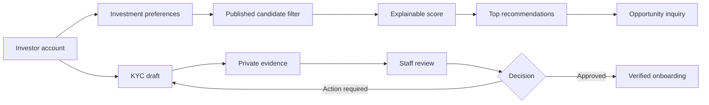
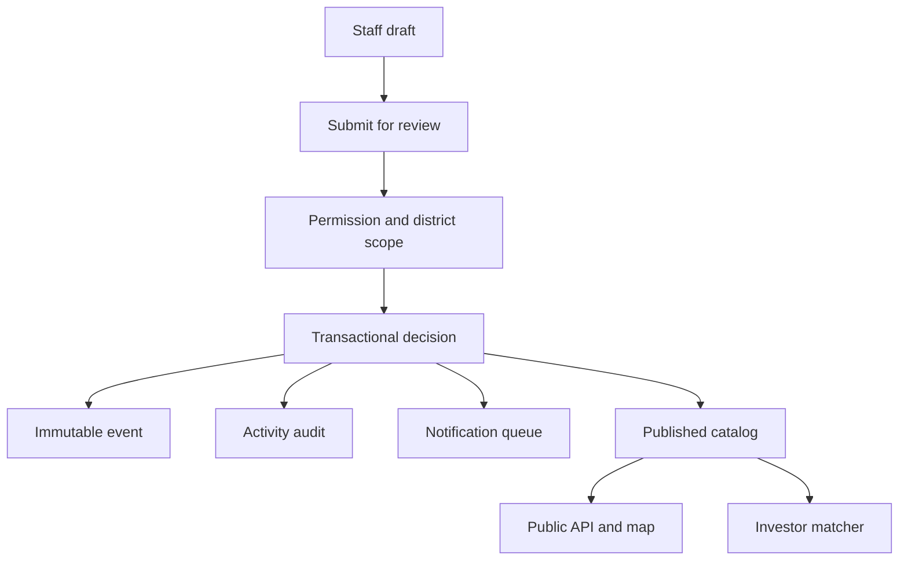

# IOMP Platform User Guide

## Investor Journey

### 1. Create and secure the account

1. Open `/register`, provide account and contact details, and verify the email address.
2. Sign in through `/login`. Investor and staff entry points are intentionally separate.
3. Use `/portal` as the working dashboard. The summary row shows matches, inquiries, KYC evidence, and onboarding status.

### 2. Define an investment mandate

In **Investment mandate**, select one or more sectors and regions, an optional capital range and currency, and an optional minimum district-readiness score. Saving replaces the current preference set atomically.

Recommendations include a score and plain-language reasons. The current deterministic weights are:

- Preferred sector: 40 points.
- Preferred region: 25 points.
- Investment amount and currency: 25 points.
- District readiness: up to 10 points.

Only published opportunities in published districts are eligible. Up to 200 candidates are considered and the best 12 are shown. No generative AI or hidden profiling is used.

### 3. Review and contact a project

Open a recommendation or the public opportunity directory. Review the project location, financial requirement, sector, district, documents, and public contact details. Submit an expression of interest from the opportunity page; retain the displayed reference for follow-up.

### 4. Complete KYC onboarding

Start onboarding from the dashboard, upload each required document, and submit when all required evidence is present. Files are private and enter quarantine. A reviewer can accept evidence, request action, approve, or reject the case. Reviewer notes and the immutable timeline appear in the investor workspace.

## Staff Journey

### 1. Access and scope

Sign in through `/staff/login`. Menus and actions depend on Spatie permissions. District Officers are further restricted by active, dated district assignments. The Super Administrator bypass remains explicit and auditable.

### 2. Govern district and opportunity data

Create drafts, submit them for review, and use the review workspace to approve, reject, publish, or activate records. Transitions use transactions and row locks, create immutable workflow events, update SLA timestamps, and write activity-log before/after values.

Published district and opportunity records feed the public directory, APIs, point map, and investor matching. Correct coordinates, sector, district, financial amount, currency, and readiness values are therefore operational data, not presentation-only fields.

### 3. Review investors

Open the investor overview and queue, inspect only the evidence required for the case, record document decisions, and complete the onboarding decision. Never download or retain KYC evidence outside the authorized workflow.

### 4. Issue and verify certificates

Authorized staff issue a certificate from a governed investor/opportunity snapshot. The platform signs the canonical payload and queues private QR/PDF artifacts. District Officers can record append-only field decisions only for assigned districts. Suspension, reinstatement, and revocation are audited lifecycle transitions. Public verification exposes a minimal current snapshot.

## Geographic Discovery

The district directory at `/districts` is usable without JavaScript and provides filters, readiness, population, and published-opportunity counts. The Leaflet map adds published opportunity points and optional browser geolocation.

`public/data/ghana.geojson` currently contains one Ghana national-outline polygon. It is context only. It must not be described as district geometry or used to assign authoritative district identity. Production district polygons require client-approved GeoJSON, validated district codes, valid EPSG:4326 geometries, and an import/rollback procedure. Browser geolocation and external geocoders are advisory inputs only.

## API Journey

Interactive documentation is at `/api/documentation`; the machine-readable OpenAPI contract is `/openapi.yaml`.

1. Public clients read paginated catalog and opportunity endpoints under `/api/v1`.
2. A trusted client posts credentials to `/api/v1/auth/login`.
3. The client sends the short-lived JWT as `Authorization: Bearer <token>`.
4. The client stores the opaque refresh token securely and submits it once to `/api/v1/auth/refresh`.
5. Refresh rotates the session. Replaying the previous refresh token fails.
6. Logout revokes the database session immediately.

Never place tokens in URLs or logs. Mobile and browser clients should use platform secure storage and avoid persistent JavaScript-accessible storage where possible.

## Operational and Security Notes

- Public, authentication, investor, certificate, and inquiry endpoints have separate rate limits.
- API collections are paginated; matching and map candidate sets are capped.
- Public resources omit KYC files, staff assignments, audit records, signature material, certificate evidence, and other investors.
- Run queue workers for workflow notifications and certificate artifacts.
- Production requires unique signing keys, TLS, restricted private storage, monitored queues, backups, approved retention, and secret rotation.
